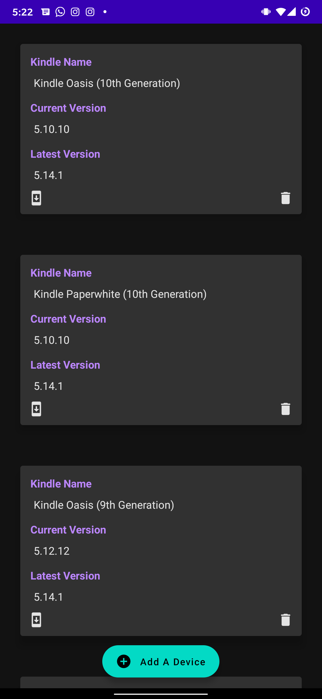
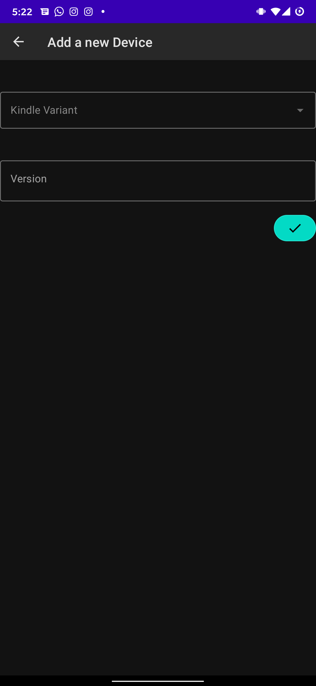

# KindleOTA
## Purpose
Auto Update on Kindle is pretty annoying so had to disable that. But I want to keep my kindle up to date so this app is made to notify me whenever there's an update.
Using [this](https://github.com/dracarys18/KindleAPI) API
## ScreenShots

ScreenShots

## Note
Development of this app is currently at halt atm. Because amazon regulary blocks the API from scraping. So you are free to build the app by hosting the API by yourself.
